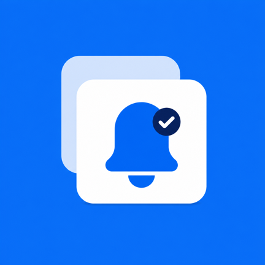
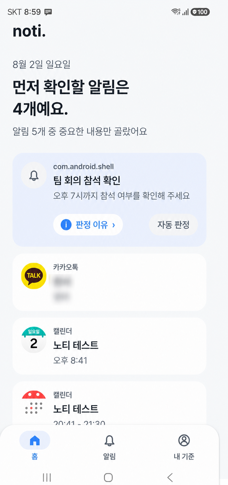
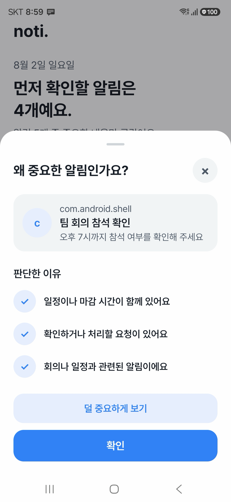
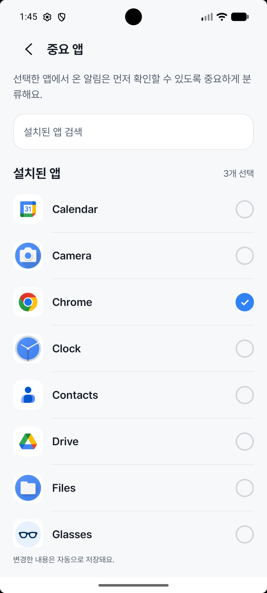
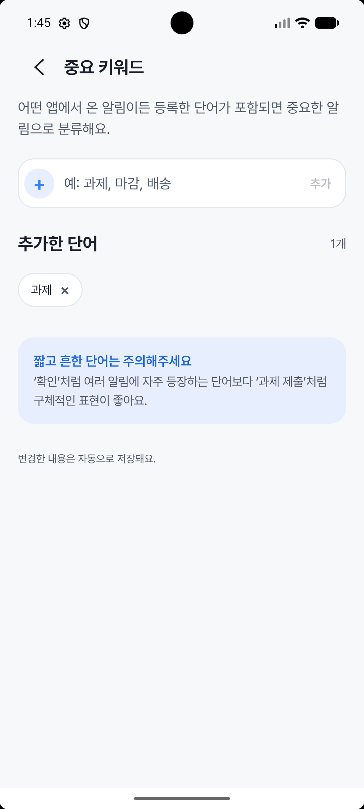
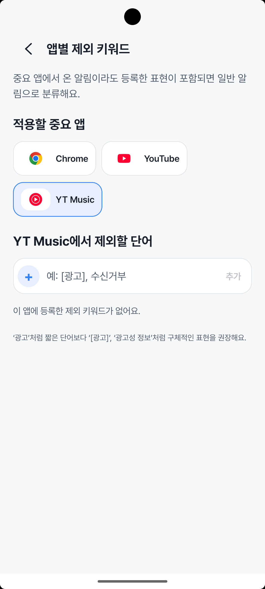

<p align="center">
  
</p>

<h1 align="center">noti.</h1>

<p align="center">
  <strong>중요한 알림을 찾고, 왜 중요한지 설명하는 온디바이스 Android 앱</strong>
</p>

<p align="center">
  <a href="https://velog.io/@imkara/series/noti."></a>
</p>

<p align="center">
  
  
  
  
</p>

---

## Overview

알림이 많아질수록 중요한 요청과 마감은 쉽게 묻힙니다. `noti.`는 Android 알림을 기기 안에서 수집하고, 사용자 규칙과 온디바이스 AI를 결합해 지금 확인할 알림을 선별합니다. 결과만 보여주는 대신 **어떤 앱·키워드·문맥 때문에 중요하다고 판단했는지** 함께 설명합니다.

> **개인 프로젝트** · 제품 기획, UI/UX 디자인, Android 앱 구현, 데이터 설계와 ML 실험 전 과정을 직접 진행하고 있습니다.

## Screens

<p align="center">
  
  
  
  
  
</p>

## Product Principles

- **Explainable** — 모든 중요 판정에 사용자가 이해할 수 있는 근거를 남깁니다.
- **Local-first** — 알림 제목과 본문을 외부 서버나 원격 AI API로 전송하지 않습니다.
- **User-controlled** — 자동 판정보다 사용자가 지정한 앱·키워드와 피드백을 우선합니다.
- **Conservative** — 확실한 규칙을 먼저 적용하고, 애매한 알림에만 AI를 사용합니다.

## Core Flow

```text
Android Notification
        ↓
NotificationListenerService
        ↓
Normalize & Filter
        ↓
Explainable Rule Engine
        ↓ ambiguous notifications only
On-device ONNX Classifier
        ↓
Room: notification + score + reasons
        ↓ Flow
ViewModel → Jetpack Compose UI
```

## What I Built

- `NotificationListenerService` 기반 알림 수집과 반복·시스템 알림 필터링
- Room에 알림, 중요도 점수, 판정 이유와 사용자 피드백 저장
- 중요 앱·포함 키워드·제외 키워드를 조합한 설명 가능한 규칙 엔진
- 규칙만으로 판단하기 어려운 구간에 한정한 ONNX Runtime 추론
- KoEn E5 Tiny INT8 모델과 네이티브 SentencePiece 토크나이저 Android 통합
- Hilt 의존성 주입, DataStore 설정 저장, Flow 기반 화면 상태 구성
- 순수 Kotlin 판정 로직, Room migration, ONNX 호환성 테스트

## Model Selection

모델의 정확도만 비교하지 않고 **실제 알림 데이터에서의 중요 알림 재현율, 오탐, 모델 크기와 모바일 추론 비용**을 함께 평가했습니다. 현재 앱에는 약 36.5 MiB의 KoEn E5 Tiny ARM64 INT8 ONNX 모델을 연결했으며, 규칙 엔진의 애매한 구간에서만 실행합니다.

모델 비교 과정과 재현 가능한 결과는 [`ml/reports`](./ml/reports)에서 확인할 수 있습니다.

## Architecture

| Layer | Responsibility |
| --- | --- |
| `notification` | 시스템 알림 수집, 파싱, 필터링 |
| `domain/importance` | 점수 규칙, 텍스트 전처리, 중요도 판정 |
| `ai` | ONNX 모델 로딩, 토크나이징, 추론 결과 매핑 |
| `data` | Room, DataStore, repository, migration |
| `ui` | 온보딩, 홈, 전체 알림, 나의 기준 화면 |

## Tech Stack

`Kotlin` `Jetpack Compose` `Material 3` `Room` `Hilt` `DataStore` `Flow` `ONNX Runtime` `C++/JNI` `JUnit`

## Testing

```bash
./gradlew test
./gradlew connectedAndroidTest
./gradlew :app:assembleDebug
```

테스트는 중요도 규칙과 AI 결과 결합, 텍스트 전처리, 데이터 매핑, Room migration, ONNX·토크나이저 호환성을 포함합니다.

## Documentation

- [제품 정의](./docs/product.md)
- [아키텍처](./docs/architecture.md)
- [중요도 정책](./docs/importance-policy.md)
- [개발 계획](./docs/development-plan.md)
- [ML 실험 및 재현 방법](./ml/README.md)

## Status

Android 출시를 목표로 개발 중입니다. 현재 알림 수집·규칙 판정·피드백·온디바이스 ONNX 추론이 연결되어 있으며, 실기기 검증과 제품 완성도를 높이는 작업을 진행하고 있습니다.
